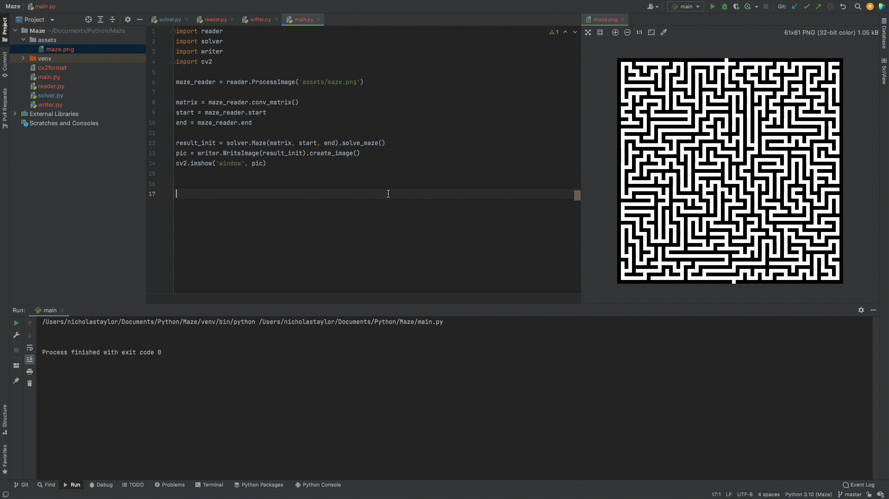

## My First Encounter With OpenCV!
This was done to learn some skills with OpenCV back in late 2021 and get some practice with backtracking algorithms. 

This program takes a maze image as input and will read the pixels into a (giant) numpy array and solve it via recursive flood-fill. Then it should output the same maze image, but now, solved.

Note, this is a **work in progress** and I'm working making it better and faster when I find the time.

Demonstration:

# Testing
To test, run:
`watchexec -i 'assets/test_resources/output/**' 'clear; python3 src/test.py'
 
https://github.com/watchexec/watchexec/